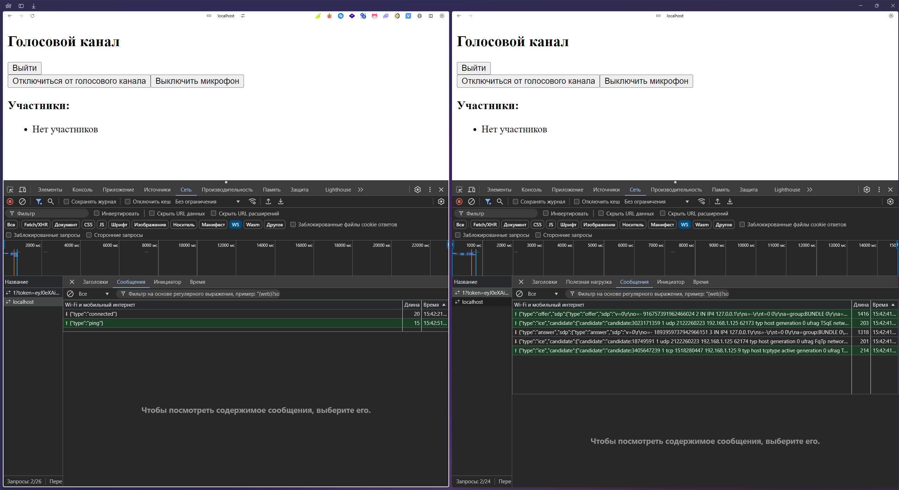
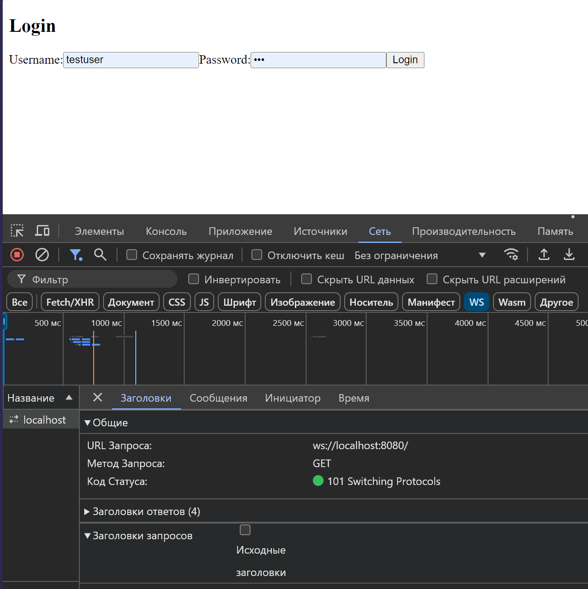
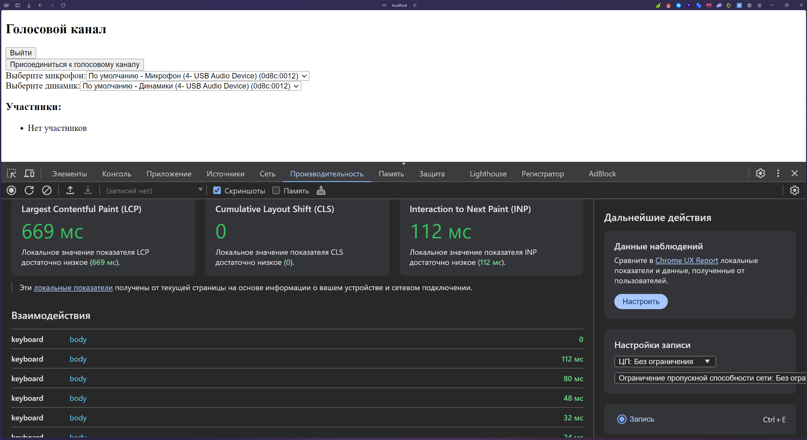
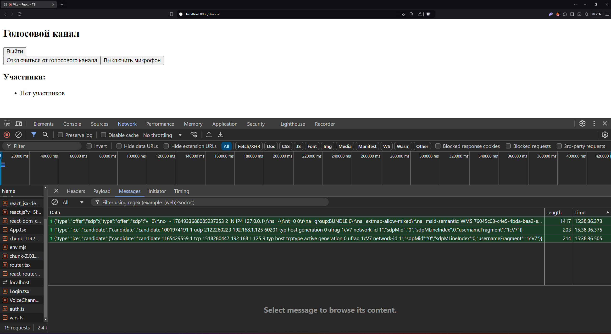

# TalkSpace
It's an a Discord alternative made with Rust






## How to start
### Server
You need to install SQLX-CLI:
```bash
cd talk_space_server
cargo install sqlx-cli --no-default-features --features postgres
# Migrate tables and run the server
sqlx migrate run
mv .env.example .env
cargo run
```
## API TEST QUERRYES
[API QUERRYES LIST](./talk_space_server/test_querryes.md)

### Client
```bash
cd client_talk_space
pnpm i
mv .env.local.example .env.local
pnpm dev
```